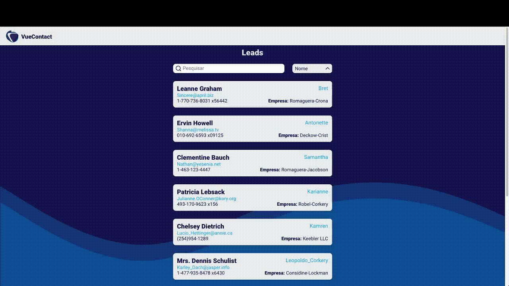

<h1 align="center">VueContact</h1> 
É uma aplicação que foi desenvolvida para conhecer, estudar e aprimorar meus conhecimentos em **vuejs** e **nuxtjs**.  

  

## 🛠 Ferramentas
- Vue
- NuxtJs
- Javascript
- Html
- Scss

## 🤔 O que é ?
Uma aplicação simples que mostra todos os contatos "leads", de uma empresa em questão.

## 👨🏽‍💻 Qual o intuito ?
Fornecer uma interface que liste os contatos de clientes em potencial. Fornecendo informações úteis que facilitem o acesso as informações.
> Deverá funcionar em qualquer tipo de dispositivo! (Responsiva)
## ⚡️ Como foi a etapa de desenvolvimento ?
Comecei criando a UI do projeto, escolhendo as cores e a disposição dos elementos em tela, que pode ser encontrada em: 
🔗 [***Link do Figma***](https://www.figma.com/file/hRTST6D86tl2iAU1EWfGSa/VueContact?node-id=0%3A1)

Após criar a interface comecei o desenvolvimento, utilizei essa api publica: 
🔗 [***Link da API***](https://jsonplaceholder.typicode.com/users)

Para finalizar fiz o deploy no heroku: 
🔗 [***Teste a aplicação***](https://vue-contact.herokuapp.com/)

## 💻 Como fazer para rodar o projeto?
**Basta fazer os seguintes passos...**

- Basta instalar as dependencias usando:
`yarn install ou npm install`

- E para rodar o projeto:
`yarn dev ou npm run dev`

## 👀 Preview

